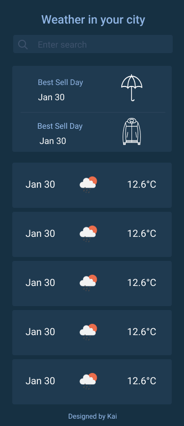

# weather mobile app

## demo online

[demo url](https://weather-app.1033523998.now.sh/)

## run

```
  yarn install
  yarn start
```

## logic

1. Get geo location from openweathermap api.
2. Get daily weather data from darksky api.
3. If weather is rain or snow buy umbrella.
4. If temperature is lower than 10buy jacket.

## UI design

[open design file in Figma](https://www.figma.com/file/BCl0y1PwSO7op6HTehwOOz/weather-app?node-id=0%3A1)


